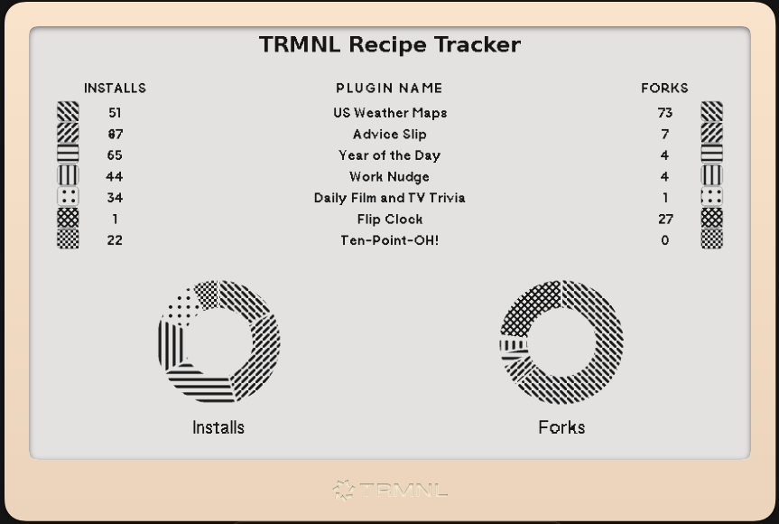

# TRMNL RCIPE TRCKR

**RCIPE TRCKR** (Recipe Tracker) is a dynamic, SVG-based analytics plugin for the [TRMNL](https://usetrmnl.com) e-ink display ecosystem.  
It displays live stats (Installs, Forks, Totals) for TRMNL community plugins across multiple layout formats — **Full**, **Half-Horizontal**, **Half-Vertical**, and **Quadrant**.

All rendering is done client-side using JavaScript + SVG, ensuring perfectly scaled, pattern-filled charts and data grids at any TRMNL resolution.



---

## 🧠 Concept

This plugin evolved from the original **Recipe Tracker** and **Plugin Scoreboard**, rebuilt as **RCIPE TRCKR** — a modern, scalable engine that draws the entire screen as SVG for pixel-level control.

The display adapts to any TRMNL layout, with shared logic for data, patterns, and rendering.

---

## 🧩 Layouts Supported

| Layout | Description | Example Use |
|:-------|:-------------|:-------------|
| **Full** | Complete screen with Donut (Pie) charts and data list | Dashboard view |
| **Half-Horizontal** | Top/bottom half, wide data table | Plugin list + summary |
| **Half-Vertical** | Left/right half, compact data | Stats sidebar |
| **Quadrant** | Smallest view for multi-panel dashboards | Quick-glance tiles |

Each layout is rendered using the shared core logic in `shared.liquid`.

---

## ⚙️ Structure

```
trmnl-rcipe-trckr/
├── full.liquid
├── half-horizontal.liquid
├── half-vertical.liquid
├── quadrant.liquid
└── shared.liquid
```

### `shared.liquid`
Contains all logic for:
- SVG generation and rendering
- Donut/pie chart creation
- Pattern definitions
- Column layout and text rendering
- `configure()` method for runtime overrides

### Layout Files
Each layout file (`full.liquid`, `half-horizontal.liquid`, etc.) includes only a one-liner to configure its dimensions and render:

```liquid
<div class="rcipe-trckr full">
  <div id="rc-root"></div>
</div>

<script>
  RCIPE_SHARED.configure({
    FULL:{ BOX:{ w:800, h:440 } },
    SHOW_DONUTS:true
  });
  RCIPE_SHARED.renderFull();
</script>
```

---

## 🧮 Configuration Options

| Setting | Description | Default |
|:---------|:-------------|:--------|
| `SHOW_DONUTS` | Toggles donut charts | `true` |
| `DONUT_SCALE` | Size ratio of donut radius | `0.60` |
| `LEGEND_ROW_HEIGHT` | Row height for legend grid | `24` |
| `HEADER_SCALE` | Text scale for column headers | `0.68` |
| `DATA_NUM_SCALE` | Text scale for numbers | `0.60` |
| `DATA_NAME_SCALE` | Text scale for plugin names | `0.60` |
| `PIES_MAX_HEIGHT` | Max donut chart height | `230` |
| `MAX_ROWS` | Limit of rows per layout | `10` (adjust per layout) |

You can override any setting dynamically per layout using `configure()` before calling `render...()`.

Example:
```js
RCIPE_SHARED.configure({
  HH:{ BOX:{ w:800, h:196 }, MAX_ROWS:6 },
  SHOW_DONUTS:false
});
RCIPE_SHARED.renderHalfH();
```

---

## 🎨 Pattern Library

All 10 SVG patterns are rendered natively for 1-bit and 2-bit TRMNL displays.

| Pattern ID | Description |
|:------------|:-------------|
| `p1`–`p6` | Crosshatch, diagonal, stripe fills |
| `p7` | Checkerboard (high-contrast, low-res friendly) |
| `p8` | Dense diagonals |
| `p9` | Dotted grid |
| `p10` | Circular dashed ring (for accents) |

These are used automatically for each plugin’s row and pie slice.

---

## 🧱 Shared Data Interface

Each layout accepts up to 10 plugin records via indexed fields (`IDX_0` → `IDX_9`), each with:

```yaml
IDX_0:
  data:
    name: "Plugin Name"
    stats:
      installs: 123
      forks: 45
```

The shared script parses all available indices and sorts them by total installs+forks.

---

## 🪄 Extending the Plugin

The design is modular:
- Add more rows: extend `IDX_0..IDX_19` in `shared.liquid`
- Add a new layout: call `RCIPE_SHARED.renderYourLayout()` after defining a `BOX` and column set
- Adjust patterns, fonts, or data bindings without breaking layout logic

---

## 🧰 Developer Notes

- Rendering is fully vector-based (SVG) — crisp on all TRMNL screens.
- Fonts: [NicoClean](https://fonts.google.com/specimen/NicoClean) is used for all text rendering.
- Works with both pattern and grayscale (2-bit) TRMNL displays.
- Tested on: TRMNL OG, TRMNL X, TRMNL Public Dashboard.
- Donut labels and legend grids auto-scale based on layout `BOX` sizes.

---

## 🧾 License

**MIT License**  
© 2025 Bryan Dort (Solarmax64)

You are free to use, modify, and distribute this plugin for your own TRMNL dashboards.  
If you fork or improve it, please consider contributing back to the community.

---

## ❤️ Acknowledgments

- **TRMNL Team** — for the flexible plugin framework  
- **Bryan Dort (Solarmax64)** — concept, design, and development  
- **ChatGPT (OpenAI)** — assistant for SVG rendering refactor

---

> “The only thing better than a clean kitchen is a clean dashboard.”  
> — *Chef’s Motto, RCIPE TRCKR*
